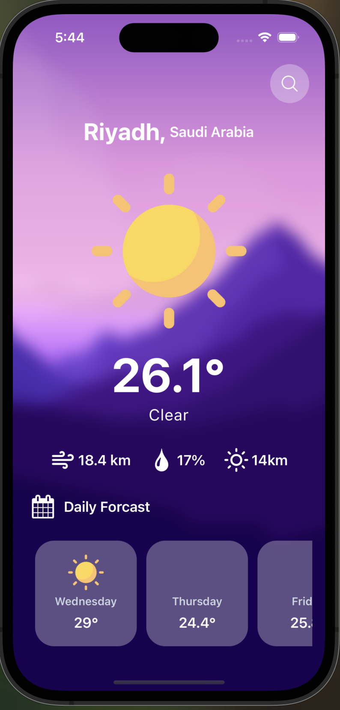
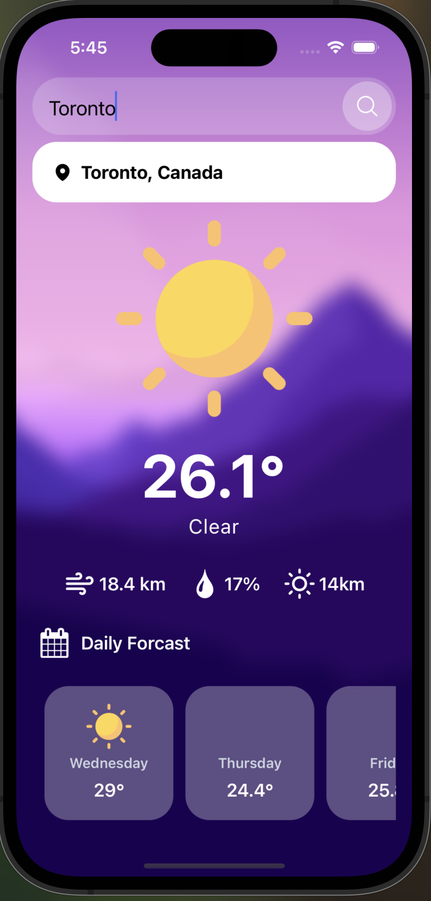
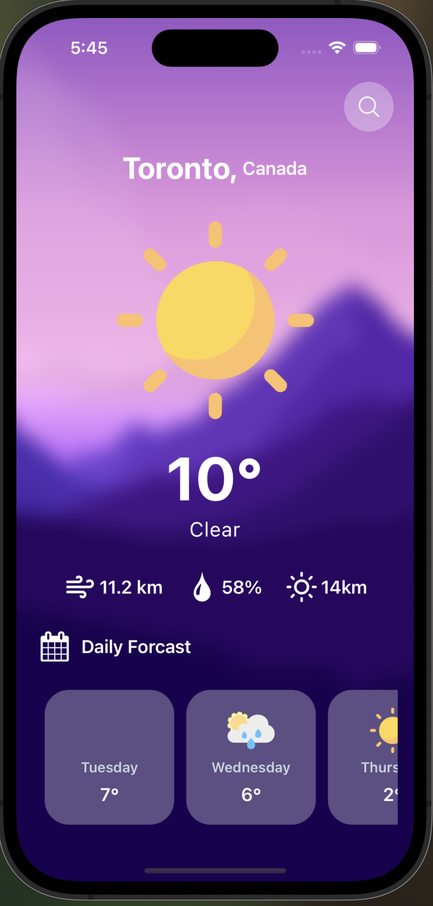

# Weather App (React Native + Expo)

## Overview
This Weather App is built using **React Native and Expo**. It allows users to search for a location and view the current weather conditions in that area.

## Features
- **Search Location**: Enter a city name to get real-time weather data.
- **Current Weather**: Displays temperature, humidity, and weather conditions.
- **User-Friendly Interface**: Simple and responsive UI for easy navigation.

## Screenshots

### Home Page


### Search Feature


### Weather Result


## Setup Instructions

### 1. Install Dependencies
Run the following command to install all required dependencies:
```sh
npm install
```

### 2. Resolve Compatibility Issues
If you encounter any issues, install specific versions of Expo and React Native:
```sh
npm install expo@~50.0.17
npm install react-native@0.73.6
npx expo install expo@latest
```

### 3. Start the Application
Once dependencies are installed, start the Expo development server with:
```sh
npx expo start
```

This will open the Expo Developer Tools where you can launch the app on an emulator or a physical device.

---

Enjoy using the Weather App! 🌤️
